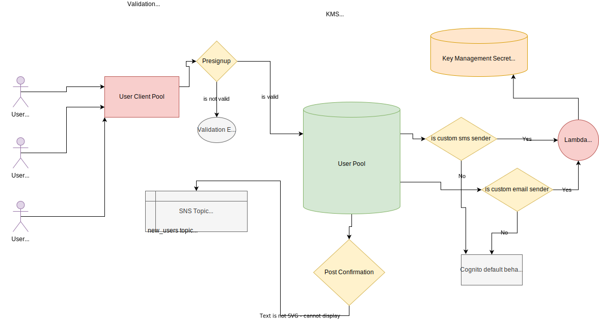

# weart-serverless-cognito

Amazon Cognito lets you add user sign-up, sign-in, and access control to your web and mobile apps quickly and easily. Amazon Cognito scales to millions of users and supports sign-in with social identity providers, such as Apple, Facebook, Google, and Amazon, and enterprise identity providers via SAML 2.0 and OpenID Connect

This plugin is making the process of adding cognito to your project peace of cake.


## Installation

Use the package manager [npm](https://www.npmjs.com/) to install the plugin.

```bash
npm install git://github.com/weartio/weart-serverless-cognito.git
```


# How it works


todo


# Testing
todo


## Usage

```yaml

service: projectname
frameworkVersion: "3"
useDotenv: true

provider:
  name: aws
  region: eu-central-1
  stage: ${opt:stage,'dev'}

plugins:
  - serverless-bundle # this to help bundling the lambda functions
  - weart-serverless-cognito # this is our lovely plugin

package:
  individually: true
  exclude:
    - "**/*"

# if you want to have the full benifits from our workflow use our labmda functions, otherwise feel free to write your own ones.
functions:
  - ${file(node_modules/weart-serverless-cognito/serverless.yml):functions}

custom:
  currentStage: ${self:service}-${opt:stage, self:provider.stage}
  cognito:
    functionsPath: "node_modules/weart-serverless-cognito/src/functions"
    customSMSSenderArn: "arn:aws:lambda:eu-central-1:${aws:accountId}:function:${self:custom.currentStage}-customSMSSender"
    customEmailSenderArn: "arn:aws:lambda:eu-central-1:${aws:accountId}:function:${self:custom.currentStage}-customEmailSender"
    smsExternalId: "1f1d7538-6e07-46e6-b0c4-5a2a0bd16215"
    loginCallbackUrl: "CALLBACK_URL"
    logoutCallbackUrl: "CALLBACK_URL"
    deleletionPolicy: Delete
    platformAllowedScope: "phone_number,email,google" # select from these options, 
    google:
      clientId: 123
      clientSecret: amsms

```


## License
[MIT](https://choosealicense.com/licenses/mit/)